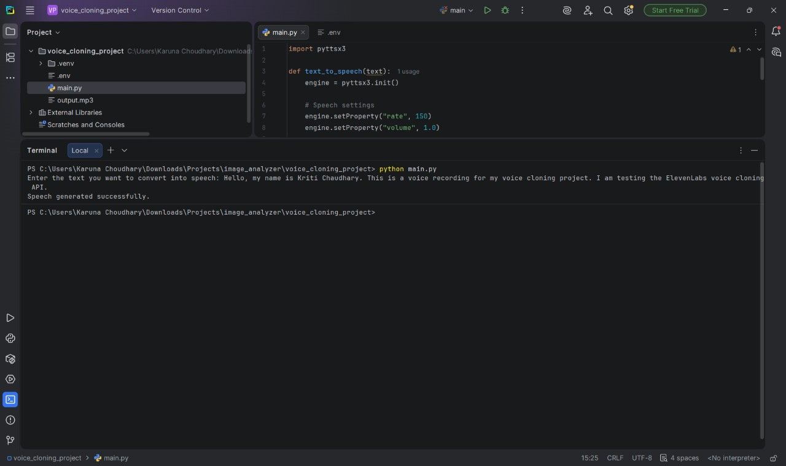

# Voice Cloning / Text-to-Speech Project

## 📌 Overview

This project is a Python-based text-to-speech application that converts written text into speech using a locally available TTS tool.

The project demonstrates basic speech generation and provides a simple way to convert text input into spoken audio.

## 🛠️ Technologies Used

* Python
* pyttsx3
* Text-to-Speech (TTS)

## ✨ Features

* Convert text into speech
* Simple command-line interface
* Uses local system voice
* Works without a paid API
* Easy to run and test

## ▶️ How to Run

1. Install Python.
2. Install the required package:

pip install pyttsx3
3. Run the program:

python main.py
4. Enter the text when prompted.

## 📂 Project Structure

voice-cloning-project/
│
├── main.py
├── output.mp3
├── output_screenshot.png
└── README.md
## 🖼️ Output

The project successfully converts the entered text into speech.

## 🎧 Sample Output

The generated audio file is included in the repository as output.mp3.

## 👩‍💻 Author

Kriti Choudhary
